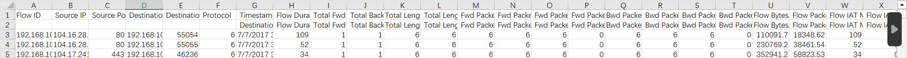

  ### 待实现
  1. 使用scapy、PyShark混合架构方案
  * 实时监测模块 realtime_monitor.py
      自己电脑开启实时监测理应全部是“正常”数据？但是有不少“可疑”数据
  2. 现DNN与LSTM分别独立对数据进行类型判断，后续考虑级联检测机制与模型蒸馏将他们配合起来使用？
  3. 貌似不需要识别加密协议也可以？以往的模型训练时都没加入协议特征。
  4. 流重组貌似也没想到怎么加入项目中。
  
  ### 备忘/待解决
  1. ~~originDNN_IDS.py、originLSTM_IDS.py是原项目 https://github.com/KlausMichael0/Taffic_Anomaly_Detection_based_on_Neural_Network 的源代码，其中originDNN_IDS.py中20行的CSV_FILE_PATH = '~/four_classification.csv'以及originLSTM_IDS.py中18行的CSV_FILE_PATH = '/Users/klaus_imac/Desktop/毕设/数据集/IDS2017/Test/dataset.csv'不知道具体指代哪些数据集，因此为了先跑通代码，testDNN_IDS.py与testLSTM_IDS.py这两个文件的数据集统一使用了根目录下的binary_classification.csv，它们是修改后的可成功运行的代码，怕后续把代码改到面目全非找不回初版，因此新建两个新py文件。~~
  LSTM需要的是时间序列的数据集，DNN需要的是非时间数据集，但实际上，同一份数据可以通过不同的处理方式适配两种模型。
  * LSTM：网络流量中的时序性攻击检测​（如DDoS攻击的流量在时间上会突然暴增、端口扫描会在一段时间内高频出现）。需要将数据组织成时间窗口。
  * DNN：处理独立样本的分类或回归任务，每个样本的特征是独立的，不依赖前后顺序。基于单条流量特征的分类（如根据单个数据包的特征判断是否为SQL注入）。每个样本是一个独立的特征向量。
  2. ~~originDNN_IDS.py中54行理解代码过程中注释中提到的LSTM的处理顺序有泄露数据的风险~~testLSTM已处理泄露数据风险
  3. ~~构建新的适合LSTM与DNN适用的数据集？~~ 原项目文件binary_classification.csv比原项目文件夹category里的csv最后多一个target标签，其余无异
  4. CICIDS2017 http://cicresearch.ca/CICDataset/CIC-IDS-2017/Dataset/CIC-IDS-2017/ 下载的两个数据集TrafficLabelling、MachineLearningCVE仅有几个标签不一样，拥有更多标签的是TrafficLabelling文件夹中的，后续准备可供LSTM与DNN共同使用的数据集时，先找一个带时间戳的，然后加上target即可。（应该这样就够了？？）
 
  5. 完善优化了一下DNN与LSTM文件的代码结构以及一些细节问题。
  6. 突然发现原项目作用没完全符合开题报告里的要求，还有一些未满足的部分，比如图神经网络应用、多模型融合、系统集成等。
  7. 仍未构建新数据集。
  ~~8. 文件夹结构框架~~
  9. 加密流量的特征
  * 加密后的数据应该看起来是随机的，没有明显的模式
  * 加密流量可能会有固定的协议头，即使数据被加密，协议本身的元数据可能还是可见的
  * 协议握手过程可能比较明显。比如TLS握手需要交换密钥，协商加密套件等，这个过程可能会有多个来回的数据包交换，形成特定的流量模式。未加密的协议如HTTP/2的前期可能也有类似的协商过程，但加密后的协议可能在握手阶段就有不同的特征。
  * 流量分析的可能性，虽然内容不可读，但通过统计流量的大小、时间、方向等信息，可能推断出用户行为。
  * 在对抗流量分析方面，有些加密协议可能会引入随机填充，或者故意调整数据包大小和时间，以混淆流量特征。
  * 加密流量可能使用不同的传输层协议，比如QUIC基于UDP，而传统HTTPS基于TCP。
  10. 加密流量在数据传输过程中的变化规律，以及这些变化如何影响流量检测的难度
  * ​握手阶段信息加密增强：TLS 1.3相比早期版本，将SNI（服务器名称指示）和证书信息加密，QUIC协议进一步减少明文字段。这使得传统依赖ClientHello包中的协议版本、密码套件等明文特征的检测方法失效，迫使检测转向更模糊的行为模式分析。
  * 密钥交换机制升级：前向安全算法（如ECDHE）的普及，使会话密钥无法通过服务端私钥回溯解密。检测方无法通过传统解密手段获取有效内容，必须依赖流量元数据和行为特征建模。
  * 协议封装与隧道技术：隐蔽信道（如DNS隧道、ICMP隧道）将恶意流量封装在合法协议内，例如Ngrok通过TLS 1.3封装RDP流量，使得传统基于协议类型过滤的规则失效。
  11. DNN
  * 其核心是通过堆叠非线性变换层（如全连接层）逐层提取数据的高阶特征，适用于静态数据的分类或回归任务
  * 自动特征学习能力强，适合高维数据（如图像、文本向量化表示），无法处理序列数据的时间依赖性，对长期关联建模能力弱。
  12. LSTM
  * 一种特殊的循环神经网络（RNN），专为处理序列数据设计，通过门控机制解决传统RNN的梯度消失问题。
  * ​遗忘门：决定哪些历史信息需要丢弃（通过Sigmoid函数输出0-1的保留权重）。
  * ​输入门：筛选当前输入中需存入记忆单元的信息（结合Sigmoid和Tanh函数）。
​  * 输出门：控制记忆单元状态对当前时刻输出的影响。
​  * 记忆单元​（Cell State）：贯穿时间步的“传送带”，存储长期依赖信息。
  13. 数据集管道： TensorFlow 中一种高效处理数据的机制，可以理解为一条“智能流水线”，负责将原始数据一步步处理成模型可以直接使用的格式，同时优化内存和计算资源。它不仅仅是一个“数据容器”，而是一个动态处理引擎。
  14. 流量过滤清单

  ### deepseek总结要做什么
  根据你的毕设项目研究内容和预期目标，系统需要实现以下核心功能模块及详细功能点：

​一、核心功能模块
​1. 数据采集与解析
~~​实时流量抓取：支持从网络接口实时捕获加密流量（TCP/UDP/QUIC等协议）~~
​协议识别：自动识别TLS/SSL、HTTPS等常见加密协议，解析协议头部元数据
​数据包重组：实现会话级流量重组（如TCP流重组），支持PCAP文件导入/导出
​2. 数据预处理
​流量清洗：过滤无效/重复数据包，处理缺失值与异常值
​特征工程：
~~统计特征提取（包长分布、时间间隔方差等）~~
~~时序特征建模（滑动窗口统计、会话持续时间等）~~
加密协议特征提取（TLS版本、密码套件、证书指纹等）
~~​数据标准化：对特征进行归一化（Min-Max/Z-Score）和维度压缩~~
​3. 异常检测引擎
​多模型集成：
监督学习（Random Forest/XGBoost + 特征选择）
深度学习（1D-CNN处理包序列，LSTM建模时序依赖）
混合模型（图神经网络处理流量拓扑关系）
​实时推理：支持微批处理（100ms级延迟）与流式计算
​4. 可视化与交互
​实时监控仪表盘：
流量热力图（源-目的IP矩阵）
协议分布环形图
异常事件时间线
​深度分析模式：
会话详情反查（原始载荷十六进制视图）
特征重要性雷达图
模型决策可视化（Grad-CAM突出可疑流量段）
​告警管理：分级告警（高危/中危/低危）与工单系统集成
​二、关键技术指标
​性能要求：

~~检测准确率 ≥85%（F1-score）~~
~~单节点处理能力 ≥1Gbps（千兆网络线速）~~
~~端到端延迟 ≤500ms（从抓包到告警）~~
​兼容性：

支持TLS 1.3/DoT/DoH等新型加密协议
适配AWS/GCP/Azure云原生环境
提供REST API供第三方系统调用
​可扩展性：

模块化架构（插件式特征提取器/检测模型）
分布式部署（Kafka+Flink流处理集群）
​三、非功能性需求
​安全审计：操作日志记录（符合GDPR合规要求）
​资源监控：CPU/内存/网络使用率实时统计
​文档体系：
技术白皮书（系统架构设计说明）
API文档（Swagger UI集成）
用户手册（含典型部署场景示例）
​四、开发技术栈建议
模块	推荐技术方案
​流量采集	libpcap（C）/ Scapy（Python） + DPDK加速
​特征计算	Apache Spark Structured Streaming + Pandas UDF
​模型服务	PyTorch Lightning + ONNX Runtime + Triton Inference Server
​可视化	Elastic Stack（Kibana） + Grafana + 自定义React前端
​部署运维	Docker Compose（开发环境）/ Kubernetes（生产环境） + Prometheus监控体系
​五、功能验证方案
​测试数据集：

基准测试：CIC-IDS2017/USTC-TFC2016
自制数据集：通过Metasploit生成模拟攻击流量
​对比实验：

Baseline方法：CICFlowMeter特征+随机森林
消融实验：验证混合模型相对单一模型的提升效果
​压力测试：

使用tcpreplay重放10Gbps背景流量
测量误报率（FPR）随负载变化曲线

